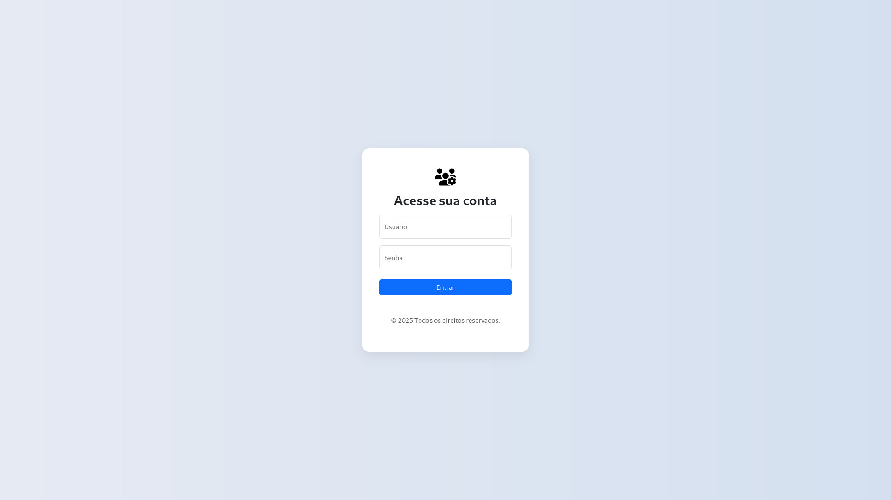
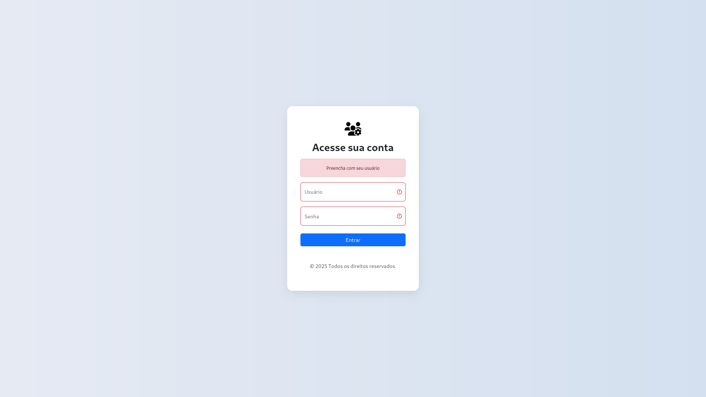
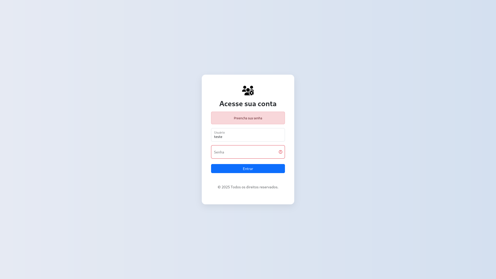
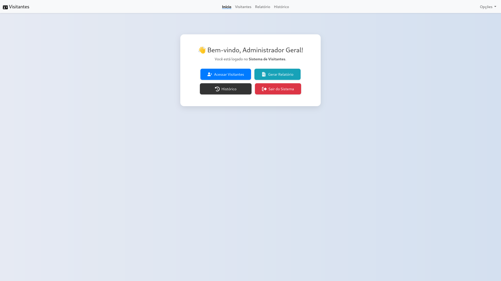

# 📋 Sistema de Cadastro de Usuários

 Este é um sistema simples de **cadastro de usuários em PHP**, com conexão a um banco de dados **MySQL** <!-- hospedado na **Render** -->.O sistema permite cadastrar as seguintes informações dos visitantes:  **CPF, nome, destino, responsável, hora da entrada, hora da saída e data da visita**, salvando os dados diretamente no banco de dados.

Além do cadastro, o sistema oferece as seguintes funcionalidades:

  ✅ **Visualização do histórico de visitas** realizadas.

  📄 **Geração de relatórios** dos visitantes de um dia específico.

<!-- --- -->

<!-- ## 🔗 Projeto Online

➡️ Acesse aqui: [https://cadastro-de-usuarios-1us6.onrender.com](https://cadastro-de-usuarios-1us6.onrender.com) -->

---

## ⚙️ Tecnologias Utilizadas

- PHP 8.x
- MySQL (phpMyAdmin)
- HTML5 / CSS3
- Bootstrap 5
- Font Awesome
- DomPDF – Biblioteca PHP para geração de arquivos PDF

---

## 📁 Estrutura do Projeto

Abaixo está a estrutura de diretórios do sistema de visitantes desenvolvido em PHP, com organização modular, uso de Docker e controle de dependências via Composer:

```
📁 Sistema de Visitantes
├── 📁 actions/
│   ├── 📁 pdf/                   
│   │   ├── 🐘 gerarPdf.php               # Responsável por gerar o PDF
│   │   └── 🐘 pdf.php                    # Contém o layout/HTML do PDF
│   ├── 🐘 create.php                     # Adiciona as informações dos visitantes no banco de dados 
│   ├── 🐘 delete.php                     # Remove registros do banco de dados  
│   ├── 🐘 read.php                       # Lista os registros existentes na tabela (exibição na aplicação)
│   └── 🐘 update.php                     # Atualiza os dados de um registro existente
├── 📁 config/
│   ├── 📁 database/
│   │   └── 🐘 conn.php                   # Conexão com o banco de dados
│   └── 📁 protect/
│       ├── 📁 styles/
│       │   └── 🎨 erro.css               # Estilos do arquivo mensagemDeErro.php
│       ├── 🐘 mensagemDeErro.php         # Página da mensagem de erro
│       ├── 🐘 protectLogin.php           # Protege rotas com autenticação
│       └── 🐘 logout.php                 # Página responsável por encerrar a sessão do usuário
├── 📁 pages/
│   ├── 📁 template/
│   │   ├── 🐘 footer.php                 # Rodapé das páginas
│   │   ├── 🐘 head.php                   # Elementos da <head> da página (metatags, título, CSS)
│   │   └── 🐘 navbar.php                 # Barra de navegação superior
│   ├── 🐘 gerarRelatorio.php             # Página de gerar Relatório
│   ├── 🐘 historico.php                  # Página do historico
│   ├── 🐘 home.php                       # Página de inicio
│   ├── 🐘 login.php                      # Página de login
│   ├── 🐘 registrarVisitantes.php        # Formulario de registrar visitantes
│   └── 🐘 visitantes.php                 # Página de controle de visitantes
├── 📁 public/
│   ├── 📁 image/
│   │   ├── 🖼️ gerarRelatorio.svg         # icon botão Gerar Relatório /pages/home.php
│   │   ├── 🖼️ gerarRelatorioBlack.svg    # icon Titulo Gerar Relatório /pages/gerarRelatorio.php
│   │   ├── 🖼️ historico.svg              # icon botão historico /pages/home.php
│   │   ├── 🖼️ historicoTitulo.svg        # icon Titulo historico /pages/historico.php  
│   │   ├── 🖼️ icon.svg                   # icon da barra do navegador
│   │   ├── 🖼️ iconNavBar.svg             # icon da barra de navegação superior /pages/template/navbar
│   │   ├── 🖼️ registrarVisitantes.svg    # icon botão Acessar visitantes /pages/home.php
│   │   └── 🖼️ sairDoSistema.svg          # icon botão Sair do Sistema /pages/home.php
│   └── 📁 styles/
│       ├── 🎨 gerarRelatorio.css         # styles da página /pages/gerarRelatorio.php
│       ├── 🎨 historico.css              # styles da página /pages/historico.php
│       ├── 🎨 home.css                   # styles da página /pages/home.php
│       ├── 🎨 index.css                  # styles da página index.php
│       ├── 🎨 login.css                  # styles da página /pages/login
│       └── 🎨 visitantes.css             # styles da página /pages/visitantes
├── 📁 routes/
│   └── 🐘 rotas.php                      # Arquivo de definição de rotas do sistema
├── 📁 vendor/                            # Dependências gerenciadas pelo Composer (não editar manualmente)
├── ⚙️ composer.json                      # Gerenciador de dependências do PHP (Composer)
├── 🔒 composer.lock                      # Lockfile gerado pelo Composer
├── 📦 docker-compose.yml                 # Configuração de containers com Docker Compose
├── 🐳 Dockerfile                         # Instruções de build do container Docker
├── 🐘 index.php                          # Ponto de entrada principal do sistema
├── ⚙️ launch.json                        # Configurações de execução para debug (VS Code)
└── 📘 README.md                          # Documentação inicial do projeto

```

---

## 🗃️ Script SQL – Criação das Tabela

Tabela visitantes.dados_visitantes

```sql
CREATE TABLE visitantes.dados_visitantes (
  id            INT           AUTO_INCREMENT PRIMARY KEY,
  cpf           VARCHAR(20),
  nome          VARCHAR(120) NOT NULL,
  destino       VARCHAR(120) NOT NULL,
  responsavel   VARCHAR(120) NOT NULL,
  hora_entrada  TIME         NOT NULL,
  hora_saida    TIME         NOT NULL,
  data_dia      DATE         NOT NULL,
  saida         TINYINT(1)   NOT NULL
);
```

Tabela visitantes.usuarios

```sql
CREATE TABLE visitantes.usuarios (
  id      INT AUTO_INCREMENT PRIMARY KEY,
  nome    VARCHAR(140) NOT NULL,
  usuario VARCHAR(140) NOT NULL,
  senha   VARCHAR(140) NOT NULL
);
```

---

<!-- ## 🌐 Banco de Dados (Render)

Estas são as informações genéricas de conexão que você precisa adaptar no arquivo `src/db.php`:

```php
$host = 'mysql-xxxx.onrender.com';
$user = 'seu_usuario';
$pass = 'sua_senha';
$db   = 'nome_do_banco';
```

> 💡 Para segurança, você pode usar variáveis de ambiente ou arquivos `.env`.

--- -->

## 🛠️ Rodando Localmente

> Para testar o sistema em seu ambiente local com PHP, MySQL e Docker:

1. **Clone o repositório:**
```bash
git clone https://github.com/fagundes321/sistema-de-visitantes.git
cd sistema-de-visitantes
```

2. **Configure os dados de conexão** no arquivo:
```php
config/database/db.php
```


3. Suba os containers com Docker:
```bash
docker compose up -d --build
```

4. Acesse o terminal do container PHP:
```bash
docker exec -it visitantes bash
```

5. Atualize as dependências do Composer:
```bash
composer update
```

6. Instale a biblioteca Dompdf:
```bash
composer require dompdf/dompdf
```
7. Saia do terminal do container:
```bash
exit
```

8. Reinicie os containers (se necessário):
```bash
docker compose up -d --build
```

9. Acesse: 
```bash
http://localhost:661
```

---

## 💻 Funcionalidades

- [x] Cadastro de visitantes (CPF, Visitante, Responsável, Horário de Entrada, Horário de Saída e Data)
- [x] Criação de relatórios em PDF por data
- [x] Visualização do histórico de visitas
- [x] Armazenamento dos dados em banco MySQL
- [x] Interface responsiva com Bootstrap
- [ ] Listagem e edição de usuários *(em desenvolvimento)*

---

## 📎 Autor

Feito por **Victor Fagundes**  
- 🔗 GitHub: [@fagundes321](https://github.com/fagundes321)  
- 💼 LinkedIn: www.linkedin.com/in/victor-fagundes-dev
- 🌐 Portfólio: https://victor-fagundes.vercel.app/
- 📧 Email: victorfagundes123@gmail.com

---

## ✅ Licença

Distribuído sob a licença MIT. Veja `LICENSE` para mais informações.

---

## 🖼️ Demonstração

### 🔐 Tela de Login

- Formulário inicial  


- Erro ao tentar logar sem preencher o **usuário**  



- Erro ao tentar logar sem preencher a **senha**  



- Erro ao informar **dados incorretos**  


---

### 🏠 Painel Principal (Home)




